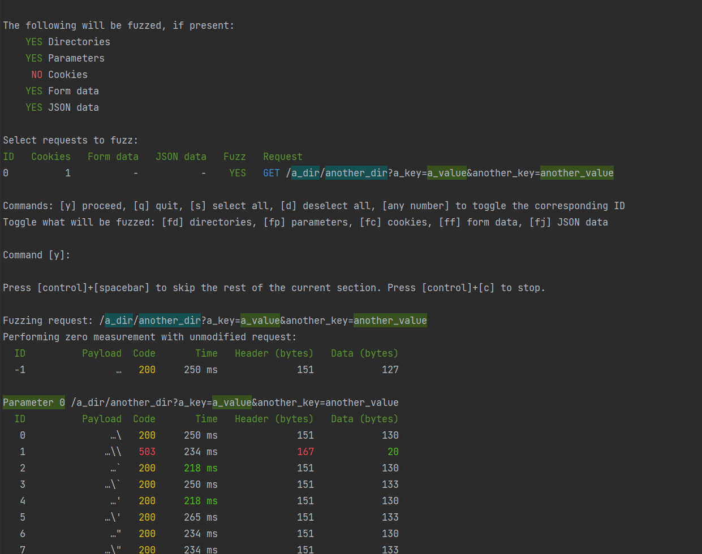

# `asdfuzz`
Web application fuzzer that automatically detects and fuzzes the following data in HTTP requests:
* URL directories
* URL parameters
* Cookies
* Form data
* JSON data

## Example


The starting point of fuzzing can be a raw HTTP request or OWASP ZAP message export.
Every individual field will be fuzzed in a separate section and the results are shown on screen.
The performed requests and received responses are stored by default in a folder called `asdfuzz_output/` for later reference.
To skip a section while the fuzzer is already running, press `[control]`+`[spacebar]`.

Individual fields in JSON data will be fuzzed recursively.
If base64-urlencoded JSON is present in parameters or cookies, this data will be fuzzed recursively as well.

## Usage
```text
Usage: python -m asdfuzz [OPTIONS]

Options:
  --filename PATH                 File containing a single HTTP request to
                                  fuzz.
  --zap-export PATH               File containing one or multiple HTTP
                                  requests to fuzz in OWASP ZAP message export
                                  format.
  --wordlist-file PATH            File containing the wordlist used for
                                  fuzzing. A default wordlist is used if this
                                  parameter is empty. In the wordlist, use
                                  template <original> to refer dynamically to
                                  the value in the original request.
  --port INTEGER                  Port used for the connection.  [default:
                                  443]
  --https / --no-https            Use HTTPS.  [default: https]
  --filter-hostname-endswith TEXT
                                  Only keep requests ending with this
                                  hostname.
  --delay-seconds FLOAT           Seconds of delay between requests.
                                  [default: 0]
  --directories / --no-directories
                                  Fuzz directories in the URL.  [default:
                                  directories]
  --parameters / --no-parameters  Fuzz values of parameters in the URL.
                                  [default: parameters]
  --cookies / --no-cookies        Fuzz the values of cookies.  [default: no-
                                  cookies]
  --form-data / --no-form-data    Fuzz the values of HTTP form data.
                                  [default: form-data]
  --json-data / --no-json-data    Fuzz the values of JSON data.  [default:
                                  json-data]
  --confirmation / --no-confirmation
                                  Enter the interactive menu.  [default:
                                  confirmation]
  --output-directory PATH         Directory where the fuzzed requests and
                                  responses will be stored.  [default:
                                  asdfuzz_output]
  --debug / --no-debug            Enable debug mode.  [default: no-debug]
  --help                          Show this message and exit.
```

## Installation
Releases are made available on PyPi.
The recommended installation method is via `pip`:

```text
pip install asdfuzz
```

For a development setup, the requirements are in `dev-requirements.txt`.
Subsequently, this repo can be locally `pip`-installed.
Developer documentation is provided [here](https://asdfuzz.readthedocs.io/en/latest/).
